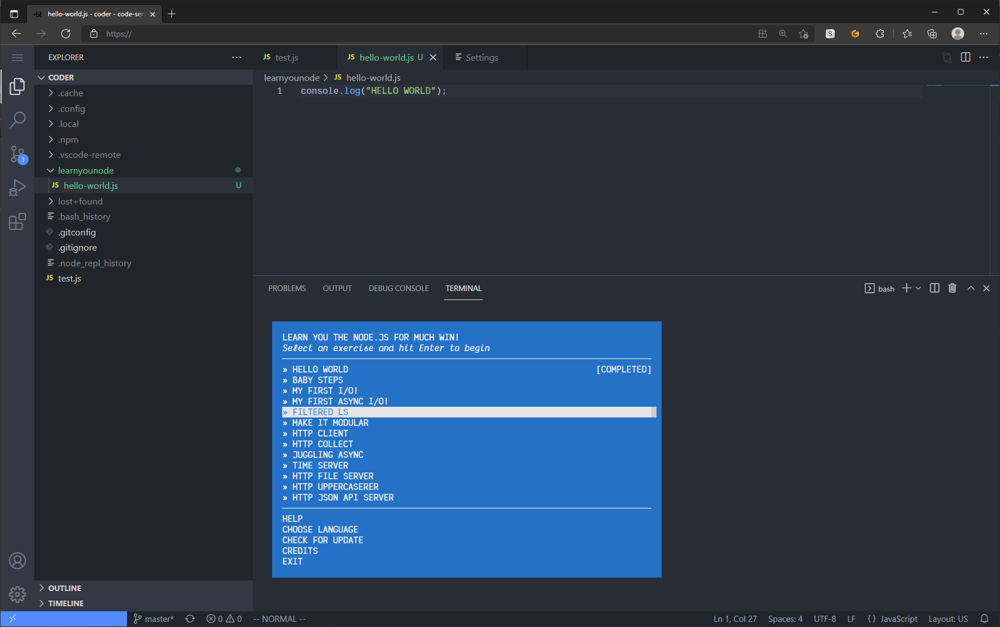

# Nodeschool Code-Server Docker Image 

This is a Docker image that will allow you to run VS Code instance in your browser, with node.js, npm, and the majority of the [NodeSchool.io](https://nodeschool.io) workshoppers pre-installed.

Built from the [Code-Server](https://github.com/coder/code-server) project.

## Dependencies

You must have Docker installed.  The simplest way is to install either [Docker Desktop](https://docs.docker.com/desktop/) or [Rancher Desktop](https://rancherdesktop.io/).

## Usage

Clone this repo:
```bash
git clone https://github.com/nodeschoolyvr/nodeschool-code-server.git
cd nodeschool-code-server
```

Build and run:
```bash
docker build -t nodeschool-code-server
docker run -d -p 8080:8080 -v nodeschool:/home/coder nodeschool-code-server --auth none
```

It will take a few minutes to build!  

Open `localhost:8080` in your browser.



Open a new terminal (Terminal > New Terminal)

Run `learnyounode` to get started! Or check out the list of workshops at [NodeSchool.io](https://nodeschool.io).  No need to install, just run the commands.

Now you can customize your editor however you see fit!  Check out [Personalize Visual Studio Code](https://code.visualstudio.com/docs/introvideos/configure) for more info.

### Workshops currently **NOT** included
* git-it
* elementary-electron
* webgl-workshop
* introtowebgl
* learnuv
* perfschool
* levelmeup
* learn-sass
* nodebot-workshop